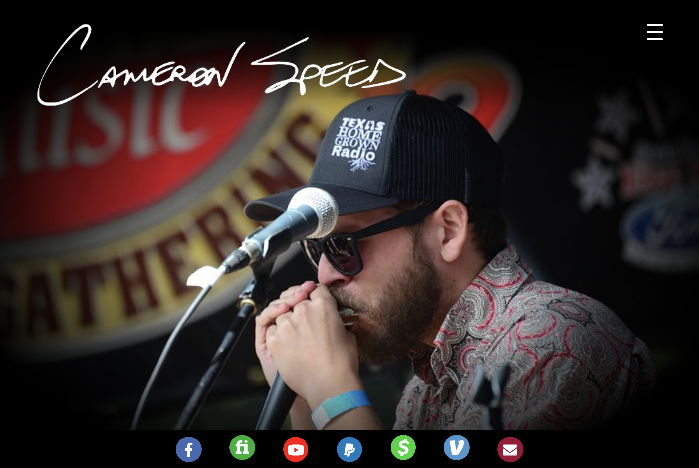
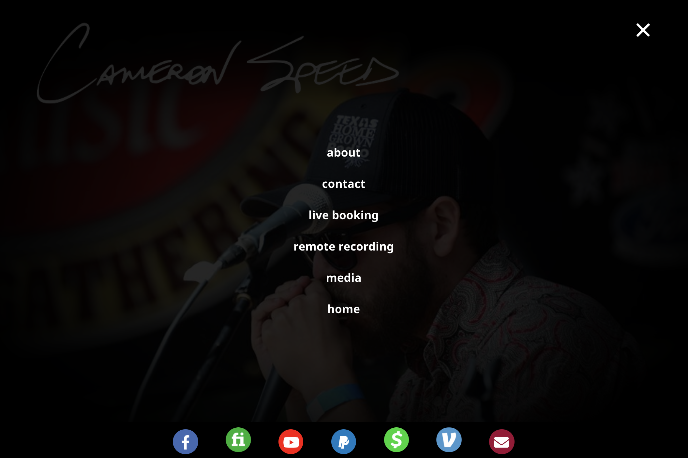
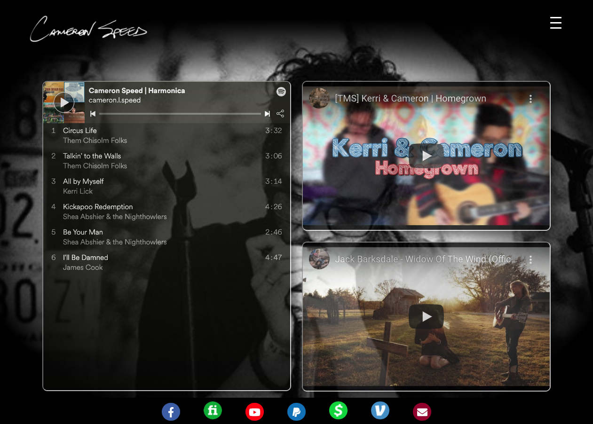
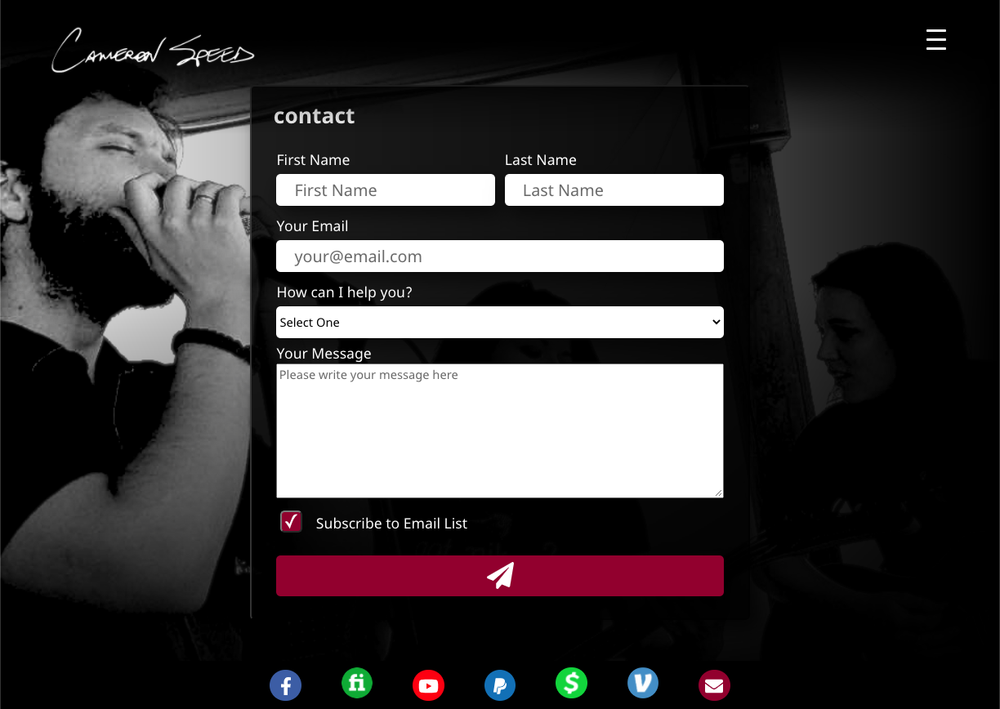

# Cameron Speed | Harmonica
This web application is a musician's marketing platform to connect to live and remote recording gigs.

## Live Version
[See the live app here!](https://www.cameronspeed.com)

## API Repo
The API Repository for email handling can be found [here](https://github.com/amyspeed/Cameron-API)

## Take a Look Inside!

### Landing Page

### Menu

### Media

### Contact

## Technologies

* React
* React Router DOM
* React Hooks
* React ToolTip
* youtube & Spotify embedded iframes
* Mailchimp API
* Netlify
* CSS
* Mobile first media queries
* JavaScript
* Node.js
* Nodemailer
* Mocha
* Chai
* Travis-ci
* Heroku